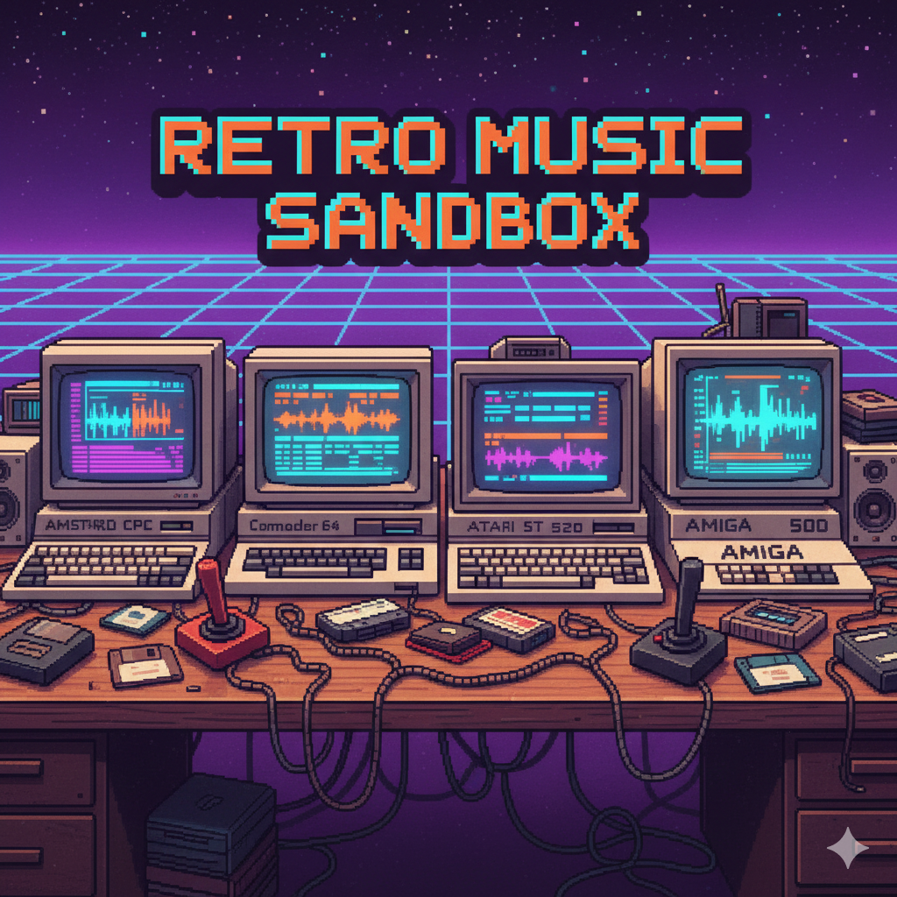

# retro-music-sandbox

A personal collection of retro-inspired music tracks created using  
[Strudel](https://strudel.cc), focusing on classic soundchips from:

- **Amstrad CPC 6128** (AY-3-8912)
- **Commodore 64** (SID 6581/8580)
- **Atari ST 520** (YM2149)
- **Amiga 500** (Paula, 4-channel PCM)

The goal is to experiment, learn, and recreate the feeling of  
8-bit and 16-bit sound engines through modern live-coding techniques.

---

## Folder Structure

### `tracks/`

Each machine gets its own folder (`cpc`, `c64`, `amiga`, `atari-st`).  
Each track lives inside a subfolder:

- `*.strudel.js` — Strudel source code  
- `*-notes.md` — musical notes, story, technical details  
- `audio/` — exported previews (mp3/wav)  
- `art/` — pixel-art or visual cover

### `docs/`

Technical documentation:

- `machine-notes/` — AY, SID, Paula, YM chip overviews  
- `track-template.md` — template for documenting a new track  
- Additional tips and research notes later on

---

## How to Use Strudel Files

1. Open <https://strudel.cc> and enter the REPL.  
2. Copy a `*.strudel.js` file into the editor.  
3. Click ▶ or press **Ctrl+Enter** to start playback.  
4. Live-edit patterns, experiment, and commit your variations.

---

## Existing Tracks

### **CPC**

- **Sky Patrol**  
  Path: `tracks/cpc/sky-patrol/`  
  A heroic flight theme inspired by 80s shooters.  
  Uses 3 voices (bass, arpeggios, lead) and a simple chord progression.

More tracks for C64, Amiga, and Atari ST will be added later.

---

## License

Up to you — suggestions:

- Music: **CC BY-NC-SA 4.0**  
- Code: **MIT License**
