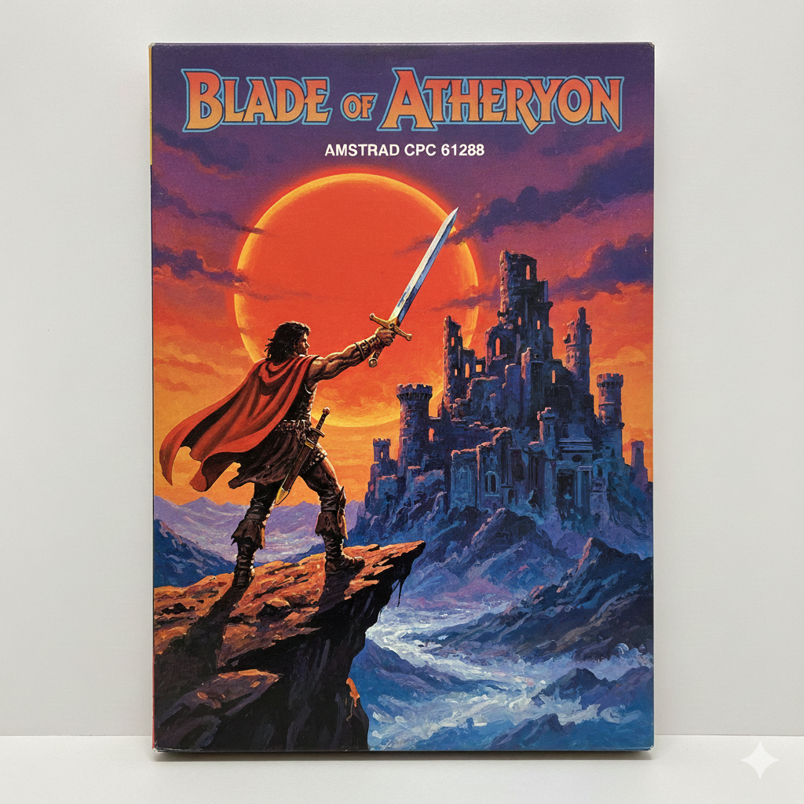
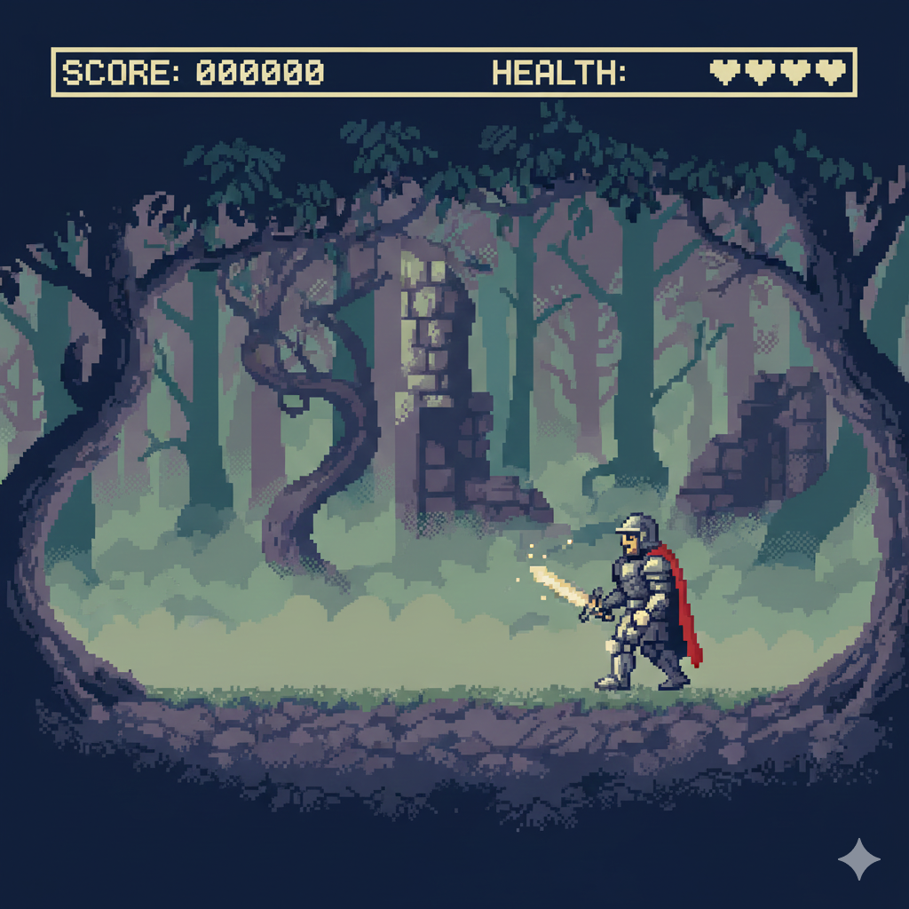
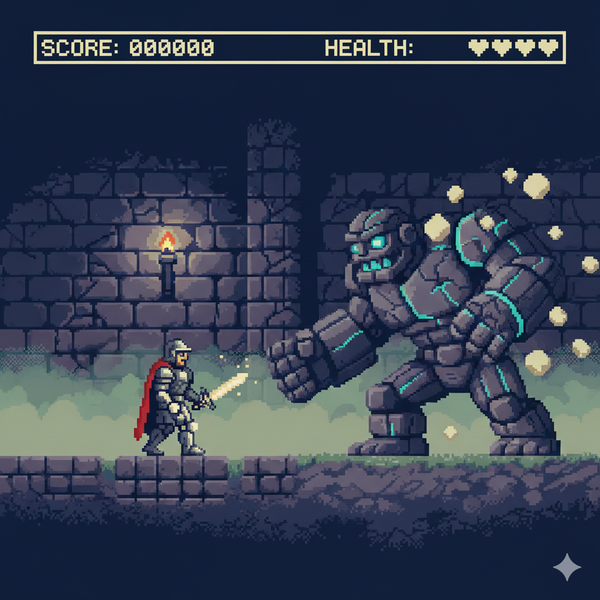
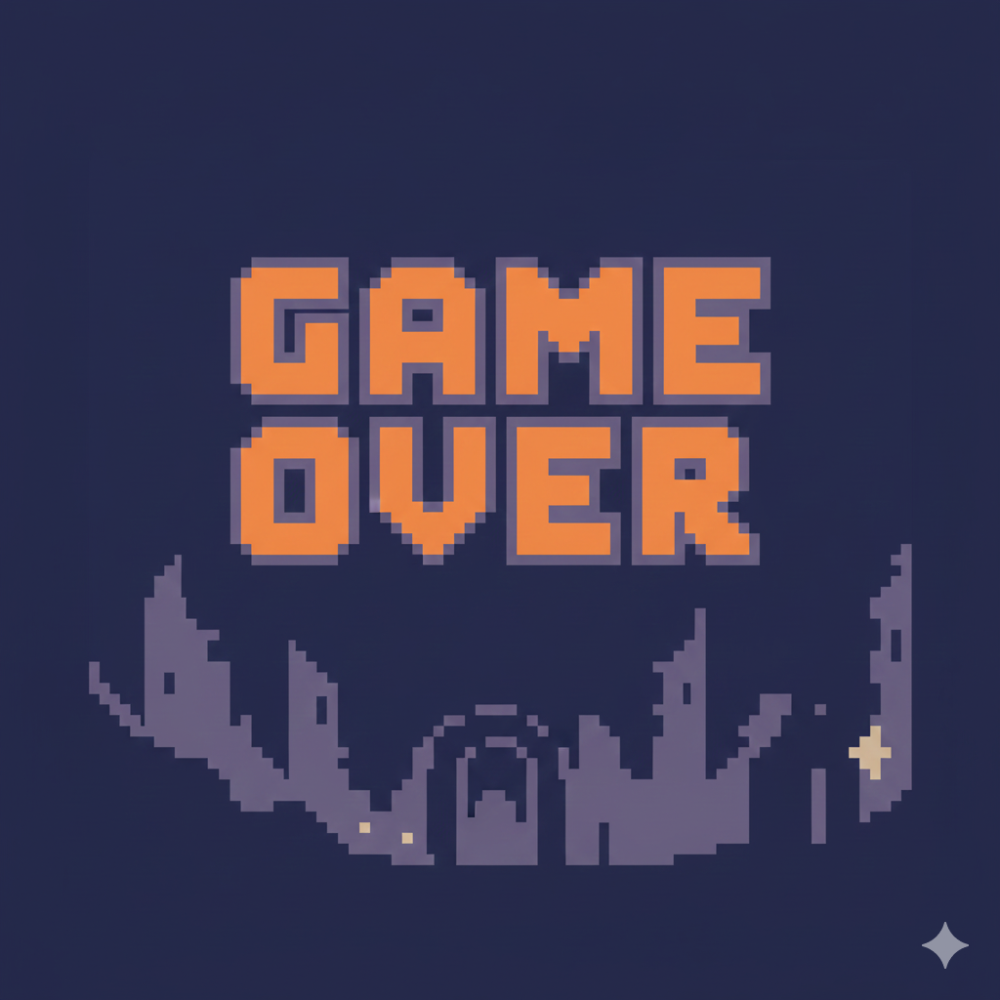
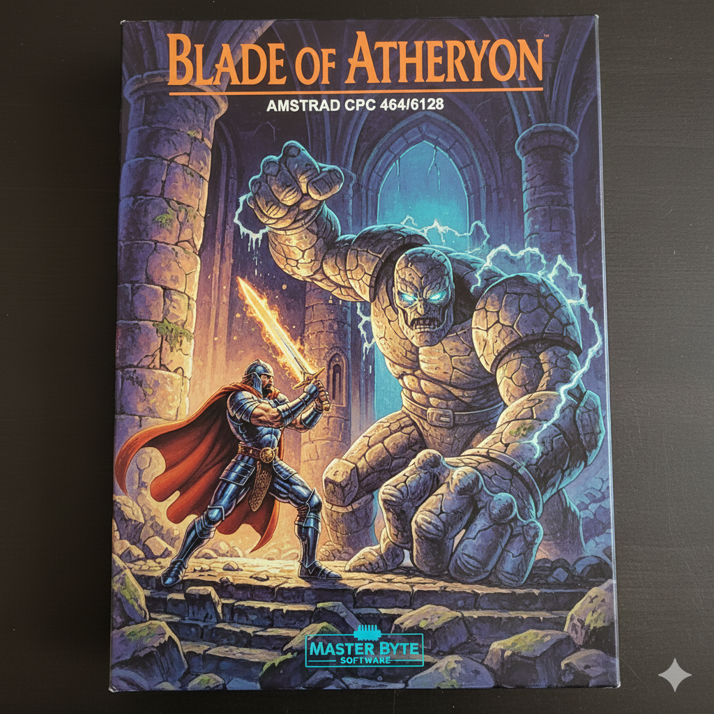

# Blade of Atheryon – Complete Overview (CPC)

## Cover Art

---

## Stage 1 Screenshot

---

## Boss 1 Screenshot

---

## Game Over Screen

---

## Game Box Art

---

## Track Information

- **Machine**: Amstrad CPC 6128  
- **Chip**: AY-3-8912  
- **Style**: Dark heroic fantasy chiptune  
- **Category**: Side-view action adventure  
- **Palette**: CPC Mode 0 (4 colors)  
- **Theme**: Forest ruins, dark magic, corrupted keep  
- **Tracks included**: Intro Theme, Stage 1 Theme, Boss Theme  

---

## Story

Long ago, during the Crimson Eclipse, the kingdom of Atheryon fell under  
the grip of an ancient warlock. Deep within the ruined keep of Shadowfall,  
he awakened the **Eclipse Forge**, a relic able to warp reality itself.

You play **Thalen**, last swordsman of the Azure Flame Order.  
Guided only by fragments of a forgotten prophecy, you must cross  
haunted forests, shimmering caverns and the forsaken outer walls  
of Shadowfall Keep to recover the **Runic Shards**—the only force  
capable of sealing the Eclipse Forge once more.

"Blade of Atheryon" faithfully emulates the look and sound of late-80s  
Amstrad CPC games: 4-color Mode 0 pixel art, 160×200 chunky graphics,  
and tight 3-voice AY chiptunes.

---

## Music Tracks

### **Intro Theme**

- Slow, mystical melody  
- Modal minor scale  
- Sets the tone of prophecy and ruins  

### **Stage 1 Theme – Whispering Forest**

- Rhythmic arpeggios  
- Dark yet adventurous tone  
- Designed for continuous horizontal scrolling  

### **Boss Theme – The Stone Golem**

- Heavy minor progression  
- Intense, percussive noise bursts  
- Emulates CPC battle tension  

All Strudel patterns for these tracks will be available in  
`*.strudel.js` and `*.strudel.json`.

---

## Technical Constraints

- **3 AY channels maximum**  
- **Square wave only**, with optional noise for effects  
- **No modern FX**, strictly CPC-era limitations  
- **Loop-safe structured patterns**  
- **Mode 0 graphics**, 4-color palette  

---

## Files

- `blade-intro.strudel.js` — intro music  
- `blade-stage1.strudel.js` — forest theme  
- `blade-boss1.strudel.js` — boss battle theme  
- `art/` — CPC-style pixel art and box illustrations  
- `audio/` — optional exports  

---

## Future Additions

- Loading screen (CPC)  
- Title screen (“Press Fire”)  
- Hi-score table  
- Cavern stage + boss  
- Outer wall stage + boss  
- Final battle against the Eclipse Warlock  
- Fictional studio splash screen
