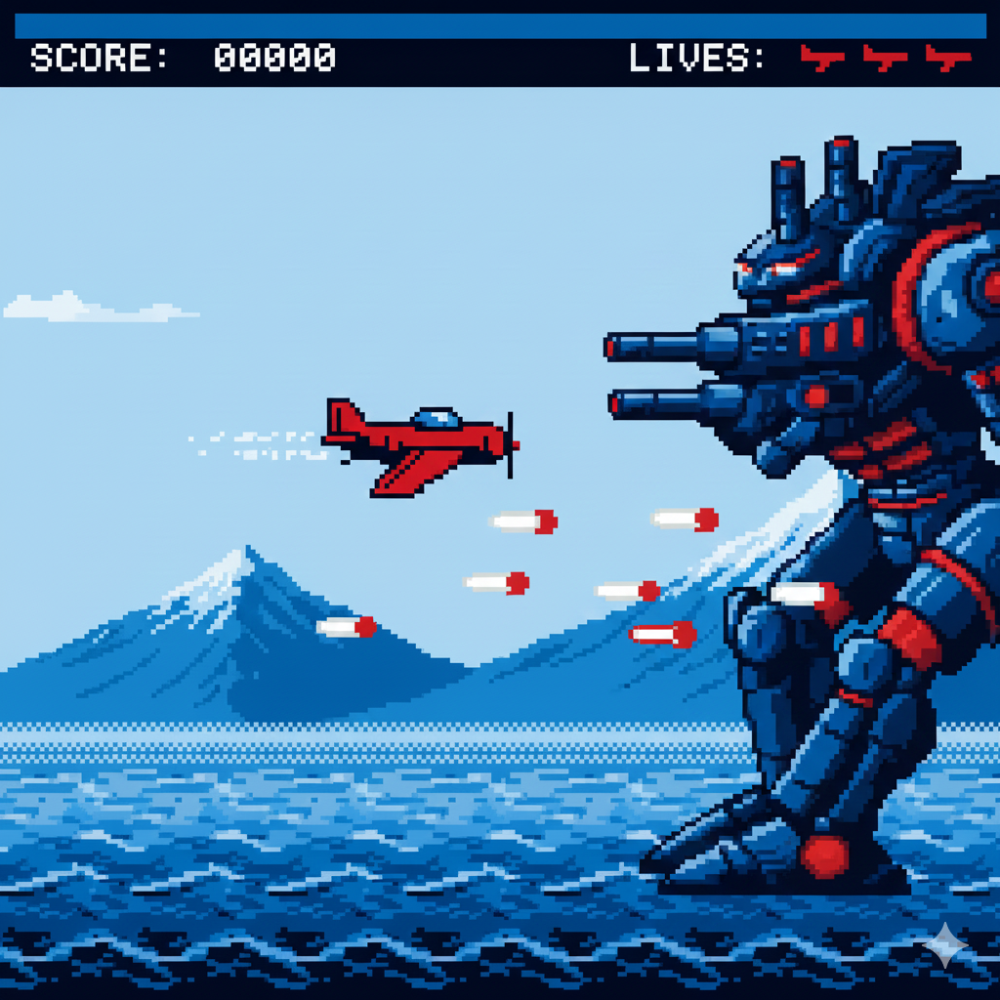

# Sky Patrol – Boss 1 (CPC)

- **Machine**: Amstrad CPC 6128  
- **Chip**: AY-3-8912  
- **Role**: First boss battle theme  
- **Key**: Cm (with tense chromatic movement)  
- **Tempo**: ~128 BPM  
- **Voices**: 3 + occasional noise bursts

## Description

The Boss 1 theme marks the first major enemy encounter in *Sky Patrol*:  
a large airborne warship or mechanized drone that fills the right side  
of the screen. The music is faster, more aggressive, and uses chromatic  
tension combined with noise bursts to evoke danger.

## Story / Scene

A massive enemy craft descends from the clouds, launching barrages of  
energy shots. Explosions flicker in orange and purple hues as the player  
dodges incoming fire. The HUD pulses red to indicate enemy lock-on.

## Technical Constraints

- 3 AY-3-8912 voices + noise (for explosions / snare-like accents)  
- No reverb, chorus, or stereo  
- Square-wave only  
- Strong rhythms and repetition suitable for boss pressure  
- Designed for short looping during the battle phase

## Structure / Harmony

- **Progression**: Cm → Db → Bb → G (chromatic tension)  
- **Lead**: aggressive repeating motif  
- **Bass**: short, punchy notes  
- **Noise**: chopped bursts simulating drums/explosions  

## Future Variants

- “Danger Phase” (faster, more noise)  
- Final hit / victory jingle  
- Intro stinger sequence before the battle begins  

## Files

- `sky-patrol-boss1.strudel.js` – Strudel code  
- `art/sky-patrol-boss1.png` – boss battle screenshot (CPC mode 0)  
- `audio/` – optional exported previews  
