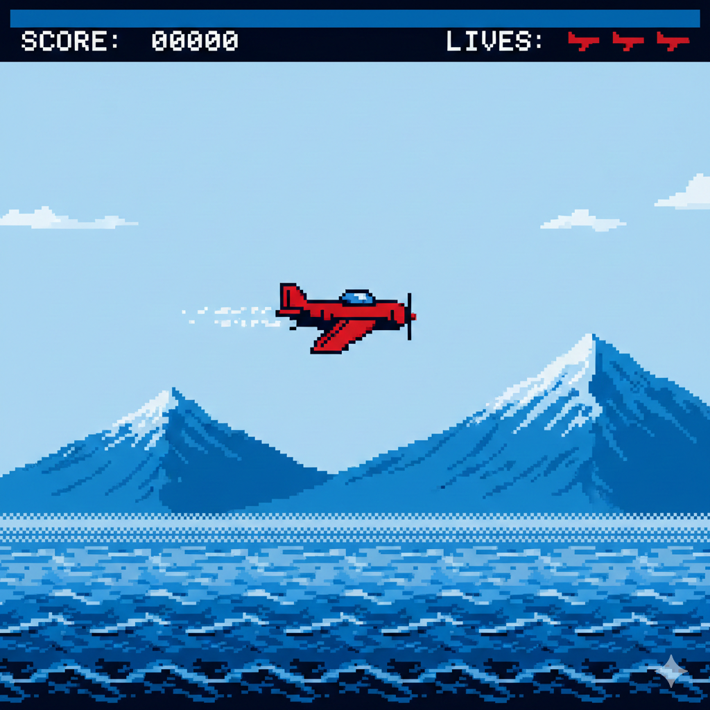
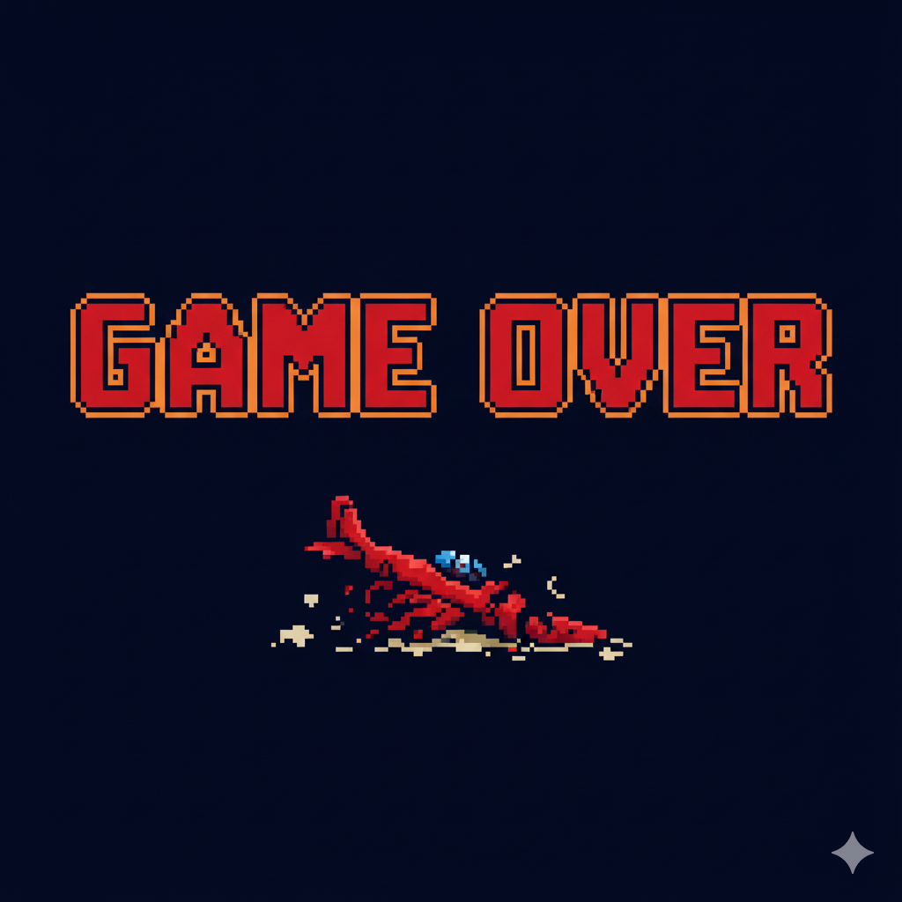
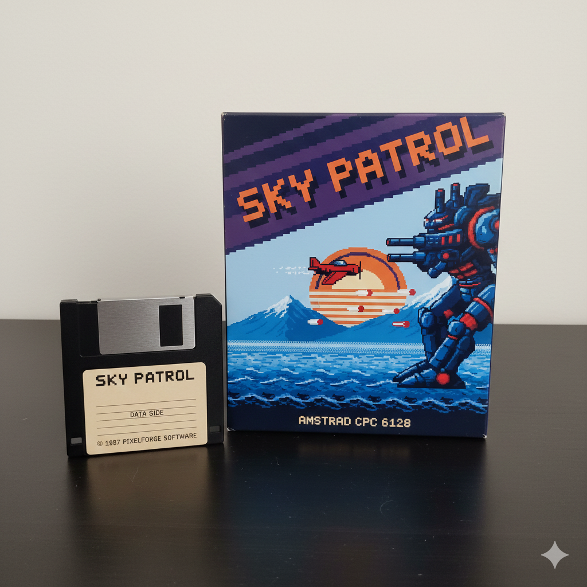

# Sky Patrol – Complete Overview (CPC)

## Cover Art

---

## Stage 1 Screenshot

---

## Boss 1 Screenshot

---

## Game Over Screen

---

## Game Box Art

---

# Track Information

- **Machine**: Amstrad CPC 6128  
- **Chip**: AY-3-8912  
- **Style**: 3-voice square-wave chiptune  
- **Category**: Horizontal shoot'em up  
- **Palette**: CPC Mode 0 (4 colors)  
- **Theme**: Heroic retro aerial combat  
- **Tracks included**: Intro, Stage 1, Boss 1  

---

## Story

Sky Patrol chronicles the first missions of a lone fighter pilot  
defending an oceanic frontier at dawn. Purple clouds drift above the  
water as enemy drones begin their assault. Later, a massive mechanical  
warship appears — the first boss.

The project recreates the visual and audio style of 1980s CPC games,  
staying faithful to 3-voice AY limitations and 4-color Mode 0 graphics.

---

## Music Tracks

### **Intro Theme**

- Calm, heroic tone
- Cm → Ab → Bb → Gm progression
- Sets the mood for a sunrise departure

### **Stage 1 Theme**

- Faster, energetic loop  
- Designed for continuous scrolling action  
- Heavy arpeggios and driving bass

### **Boss 1 Theme**

- Tense and aggressive  
- Chromatic progression: Cm → Db → Bb → G  
- Noise bursts for explosions and pressure

All Strudel code for these tracks is included in  
`*.strudel.js` and `*.strudel.json` files within this folder.

---

## Technical Constraints

- **3 AY voices maximum**
- **Square-wave only**, except noise channel emulation
- **No reverb, stereo, or modern FX**
- Patterns designed to be playable on real hardware
- Loop-safe structure for gameplay

---

## Files

- `sky-patrol.strudel.js` — intro theme  
- `sky-patrol-stage1.strudel.js` — stage theme  
- `sky-patrol-boss1.strudel.js` — boss battle theme  
- `art/` — all pixel art, screenshots, box art  
- `audio/` — exports (optional)

---

## Future Additions

- Loading screen (CPC style)  
- Title screen / Press Fire  
- Hi-score table  
- Stage 2 + Boss 2  
- Splash screen for fictional publisher  
- Real CPC color palette references  
