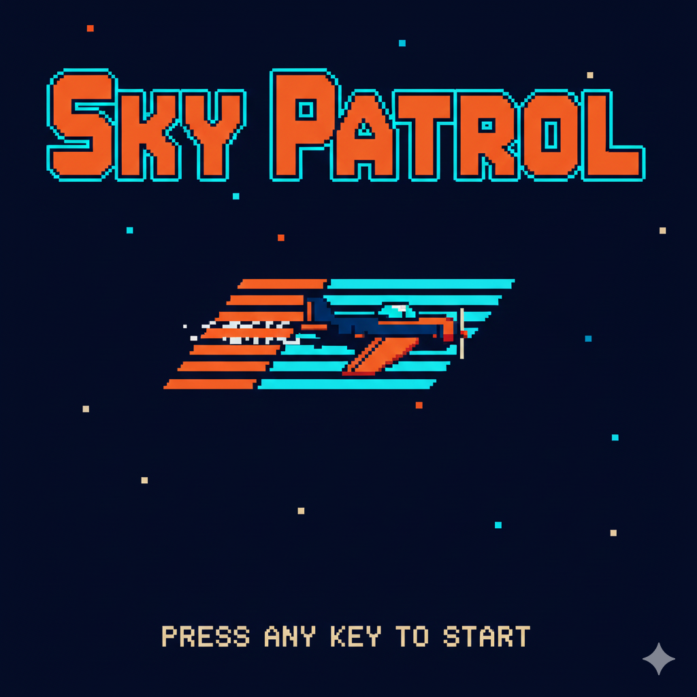

# Sky Patrol (CPC)

- **Machine**: Amstrad CPC 6128  
- **Chip**: AY-3-8912  
- **Role**: Opening stage / flight theme  
- **Key**: Cm  
- **Chord progression**: Cm → Ab → Bb → Gm  

## Story

The Sky Patrol squadron takes off at dawn above a neon-colored ocean.  
The pilots climb into the sky as pixel clouds drift by, preparing for  
their first mission against an incoming fleet of enemy drones.

This track aims to capture the heroic vibe of early 80s home computer  
shooters while staying within the constraints of a 3-voice AY soundchip.

## Technical Constraints

- 3 voices maximum (AY-3-8912 limitation)  
- No reverb, delay, or stereo effects  
- Square-wave only + occasional noise  
- Fast arpeggios simulate “extra voices”  
- Designed to be portable to a real AY engine later

## Future Variants

- **Dirty version** using bitcrush + distortion  
- **Stage 2** faster / more aggressive version  
- **Boss theme** using heavy noise bursts  
- **Loader screen** minimal variant  

## Files

- `sky-patrol.strudel.js` — Strudel source code  
- `art/sky-patrol-cover.png` — pixel-art cover  
- `audio/` — optional exported previews  
